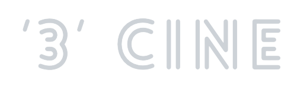

 

  

<h2>🔥 '3'CINE 🔥</h2>
  
cgv를 모티브로 구현하였습니다.
점심먹고 휴식하기 좋은 시간 3시! 코드로 힐링하자는 의미에서 '3'CINE라고 이름 지었습니다.

  
<h2>🔍 주요 기능</h2>
  
영화 검색, 상영 일정 및 상영관 정보, 좌석 선택, 예매 정보 입력, 결제, 리뷰 및 평가, 회원가입 및 로그인, 관리자 대시보드

  
<h2>📆 개발 기간</h2>
  
2023.9.8 ~ 2023.9.22

  
<h2>⚙️ 개발 언어 및 개발 환경</h2>
  
  
  
  
  
   
  
  
  
   
  
  
   
  
  
   
  
  

  
<h2>📌 사용 API</h2>
  
  
  
   
  영화진흥위원회, KG이니시스

  
<h2>💁🏻‍♂️ 역할분담</h2>
  
진평 & 영준 : 메인 페이지, 상세 페이지  
선범 & 영환 : 로그인, 마이 페이지, 관리자 로그인, 영화 검색  
순영 & 연주 : 영화 예매, 좌석 선택, 결제

  

  
<h2>메인 페이지</h2>
  
  

  
<h2>함께한 팀원들</h2>
  
👧🏻순영(조장) : https://github.com/ssunvibesonly  
🧑🏻‍🦱영준 : https://github.com/sleepysudal  
🧔🏻‍♂선범 : https://github.com/SEONBEOM928  
👦🏻영환 : https://github.com/spore2429  
👩🏻연주 : https://github.com/qqqkyj 
  

